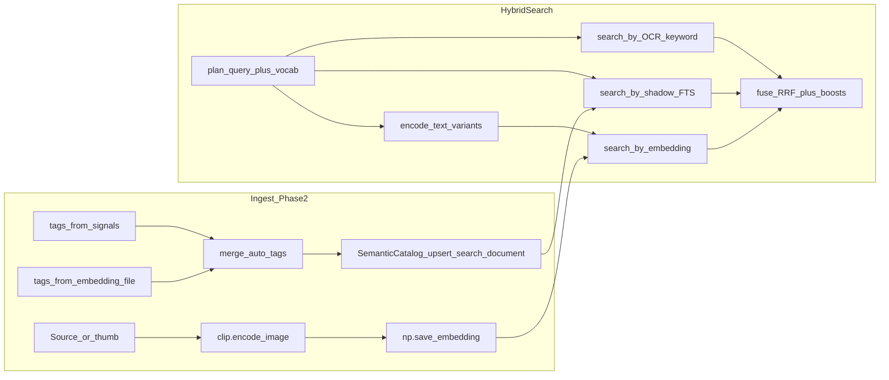

# 이미지 임베딩 태그 + 자연어 검색 리뷰

## 현재 데이터 흐름

- **임베딩**: [`pipeline.py`](c:\Source\photome\app\services\processing\pipeline.py)에서 원본 경로 우선 `encode_image`, 실패 시 썸네일 폴백 후 `embeddings_root`에 저장.
- **임베딩 기반 태그**: [`auto_tags.py`](c:\Source\photome\app\services\analysis\auto_tags.py)가 저장 벡터와 **텍스트 프롬프트 평균 벡터**의 내적·임계값으로 히트; 별칭은 [`clip_concepts.yaml`](c:\Source\photome\app\services\analysis\clip_concepts.yaml) + `max_aliases_per_concept`로 상한.
- **검색**: [`hybrid.py`](c:\Source\photome\app\services\search\hybrid.py)가 플래너 → OCR → 모드 결정 → shadow + CLIP 변형 병렬 → RRF, CLIP 무결과 시 가중치를 shadow로 이동.
- **CLIP 질의 변형**: [`query_translate.expand_for_clip`](c:\Source\photome\app\services\search\query_translate.py) (필러 제거, 템플릿 문장, lexicon 번역, 영어 확장).
- **태그 동의어(검색)**: [`synonyms.load_tag_synonyms`](c:\Source\photome\app\services\search\synonyms.py) = `tag_synonyms.yaml` + CLIP `concept_aliases` 클러스터 병합 → [`backend.py`](c:\Source\photome\app\services\search\backend.py)에서 shadow/태그 매칭 확장에 사용.

---

## 잘 맞는 점 (방향성과 정합)

- **이중 경로**: 같은 임베딩이 (1) 벡터 검색 (2) 개념 매칭으로 풀어 쓴 태그 → FTS/shadow에 실리는 구조라, CLIP이 약해도 텍스트·태그로 보완 가능.
- **운영 튜닝**: 하이브리드 가중치·RRF·부스트·캐시 TTL이 env로 노출되어 있음 ([`hybrid.py`](c:\Source\photome\app\services\search\hybrid.py) 상단 상수).
- **버전 분리**: 임베딩·auto_tag·search document는 파이프라인 버전 필드로 무효화 가능 (기존 AGENTS/CLAUDE 정책과 일치).
- **최근 개선**: CLIP 개념/별칭과 검색 동의어의 **드리프트 완화**를 위해 YAML + 클러스터 병합으로 정리됨.

---

## 남은 리스크·개선 여지

| 영역 | 내용 |
|------|------|
| **임베딩 소스 vs `_analysis_source_path`** | `_analysis_source_path`는 썸네일 우선, `_materialize_clip_embedding`은 `current_path` 우선이다. 제품 스펙(A/B/C, 아래 «스펙 메모») 미확정 시 운영 해석이 갈린다. |
| **개념 벡터 캐시** | `_concept_vectors`가 `lru_cache`로 프로세스 생애 동안 고정. **YAML만 바꾸고 서버 재시작 없이** 핫 리로드하면 태깅은 옛 프롬프트 벡터를 쓸 수 있음(재시작 전제는 RUNBOOK/주석에 명시하는 편이 안전). |
| **태깅 vs 검색 프롬프트 불일치** | 검색은 사용자 질의를 `expand_for_clip`으로 바꾸고, 태깅은 **고정 영어 프롬프트**만 사용. 의도적으로 분리된 것이지만, 새 “시각 개념”을 추가할 때 **검색 lexicon/template**과 **clip_concepts**를 함께 손봐야 효과가 난다는 운영 부담은 남음. |
| **파일명 휴리스틱** | 완료: 파일명 기반 auto-tag rule은 [`filename_tags.yaml`](c:\Source\photome\app\services\analysis\filename_tags.yaml)로 이동. `semantic_auto_tag_version` bump 대상임. |
| **Receipt 등 시그널** | `_looks_like_receipt` 등 한글 힌트가 코드에 있음. 동일하게 설정화 여지. |
| **학습형 리랭킹** | `RerankerProtocol`은 있으나 기본 패스스루. Search 이벤트 로그는 있으나 **오프라인 평가/가중치 학습**은 미연결. |
| **품질 회귀 방지** | 완료: 대표 visual/OCR 질의에 대해 `effective_mode`와 debug `channel_stats`를 고정하는 골든 테스트 추가. |

---

## 스펙 메모: CLIP 입력 — «원본 우선»과 페이즈1/2 (질문 1번 정리)

**코드가 하는 일(현재)**  
[`_materialize_clip_embedding`](c:\Source\photome\app\services\processing\pipeline.py): `encode_image(media_file.current_path)` 우선 → 실패 시에만 `derived_root/.../thumb/...jpg` 폴백.  
즉 «원본»은 **반드시 로컬 SSD에 풀해상도 복사된 파일**이 아니라, 인덱스에 잡힌 **`current_path`가 가리키는 바이트**(대개 NAS 마운트 읽기 전용)를 의미한다.  
**저장하는 것**은 임베딩 `.npy`(및 DB의 embedding_ref)뿐이고, 원본을 페이즈1에서 로컬로 끌어와 둘 필요는 **스펙상 필수가 아님**(NAS가 읽기 가능하면 그 경로로 CLIP이 읽는다).

**페이즈1 «캐시해오며 썸네일»과의 관계**  
- 페이즈1에서 만드는 썸네일/파생물은 **UI·OCR·폴백 입력**용.  
- 임베딩이 원본 경로 우선이면 **썸네일이 먼저 있어야 CLIP이 도는 것은 아님**. 다만 원본 읽기 실패 시 썸네일이 이미 있어야 폴백이 성공한다.  
- 따라서 «순서가 꼬인다»기보다, **의존성은** `원본 읽기 가능 → 즉시 임베딩 가능` / `원본 불가 → 썸네일 존재 시에만 임베딩 폴백` 이다.

**페이즈1/2 동시 실행 불가 (DB 단일 writer 직렬화)**  
코드상 라이브러리 잡은 한 번에 하나만 돌아가게 막혀 있다([`scan.py`](c:\Source\photome\app\api\scan.py) busy 응답, [`scheduler/service.py`](c:\Source\photome\app\scheduler\service.py)에서 활성 잡 시 다른 페이즈 스킵). 이것과 CLIP 입력 정책의 관계는 다음과 같다.

- **A안(원본 경로 우선, 현행)**: **상관 없음.** 임베딩은 `current_path`만 읽을 수 있으면 되고, 썸네일과 **같은 잡·같은 시각**에 있을 필요가 없다. 시간적으로 「페이즈1 스캔 → 이후 페이즈2 시맨틱」처럼 **직렬**이어도 되고, 오히려 그게 자연스럽다. NAS가 살아만 있으면 이론상 썸네일 없이도 페이즈2만으로 벡터 생성 가능(폴백 미사용).
- **B안(썸네일만 CLIP)**: DB 직렬화는 그대로 두어도 되지만, **파일 단위 선행 조건**이 생긴다 — 해당 미디어에 대해 썸네일(또는 합의된 저해상 입력)이 **이미** 존재한 뒤에만 페이즈2가 그 파일을 임베딩해야 한다. 즉 «페이즈 동시 불가」와 별개로 **파이프라인/상태 머신**에서 `thumb_done`(등) 선행을 스펙으로 박아야 한다.

**제품 스펙으로 갈라질 수 있는 옵션**

| 옵션 | 의미 | 페이즈1 전체 로컬 복사 | 페이즈 순서 압력 |
|------|------|------------------------|------------------|
| **A. 원본 경로 우선 (현행)** | NAS(또는 소스)에서 직접 디코딩, 벡터만 로컬 저장 | 불필요(읽기만 되면 됨) | 잡은 직렬이어도 됨; 파일당 썸네일 선행 **불필요**(폴백만 썸네일 의존) |
| **B. 썸네일(또는 프리뷰)만으로 CLIP** | IO/대역폭 절약, 일관된 해상도 | 원본 로컬 복사는 여전히 불필요하지만 **썸네일 생성이 임베딩 선행** | **파일당** 저해상 입력 존재 후 페이즈2 처리(상태 머신 명시). 잡 직렬화와 별개로 선행 조건 추가 |
| **C. 원본 로컬 복사 후 임베딩** | NAS 끊김에도 동일 품질 재현 | 스펙 아웃 중이라면 여기 확정 필요 | 복사 파이프라인·용량·정책이 추가됨 |

**정리**  
«임베딩값만 원본 기준으로 추출하고 로컬에는 벡터만 둔다»는 **현행 A와 호환**된다. 페이즈1에서 **원본 파일 전체를 로컬에 싣는 것**은 CLIP 품질만 놓고 보면 **필수는 아니고**, NAS 오프라인·성능·정책에 따라 **C**를 택할지가 스펙 결정이다.  
플랜 항목 `doc-clip-source`는 위 A/B/C 중 하나를 **RUNBOOK + ARCHITECTURE 한 단락**으로 고정하는 것으로 범위를 좁히면 된다.

---

## 선택적 후속 작업 (우선순위 제안)

1. **문서/주석 정렬**: 위 표 중 **A / B / C** 제품 결정 후 [`pipeline.py`](c:\Source\photome\app\services\processing\pipeline.py) 동작(원본 경로 vs 썸네일 우선)과 RUNBOOK을 한 줄로 일치시킴. B 선택 시 스케줄러/잡 순서(썸네일 선행) 명시.
2. **lexicon 단일 체크리스트**: `clip_concepts.yaml` 변경 시 `vocab_seed.yaml` / `query_translate` seed와 함께 검토한다는 체크리스트를 engineering doc 또는 `clip_concepts.yaml` 상단 주석에 추가.
3. **파일명 패턴 YAML화**: 완료. `_FILENAME_KEYWORD_TAGS`를 패키지 YAML로 이동.
4. **골든 검색 테스트**: 완료. `바다 여행`, `영수증 오류` 대표 질의로 `effective_mode` / 채널 hit 수 회귀 방지.
5. **선택**: 완료. YAML 변경은 운영 기본값으로 서비스 재시작 + 버전 bump를 문서화했고, 테스트/미래 admin reload용 cache clear helper를 제공.

---

## 결론

임베딩 → 태그 → shadow/벡터 검색으로 이어지는 **아키텍처는 방향성과 잘 맞고**, 최근 YAML 분리로 **CLIP·검색 동의어 정합성은 이전보다 좋아진 상태**다. 남은 것은 **소스 이미지 정책 명확화**, **파일명/영수증 등 잔여 하드코딩 정리**, **개념·검색 시드 공동 운영 절차**, **골든 테스트** 같은 운영·품질 층이다.
